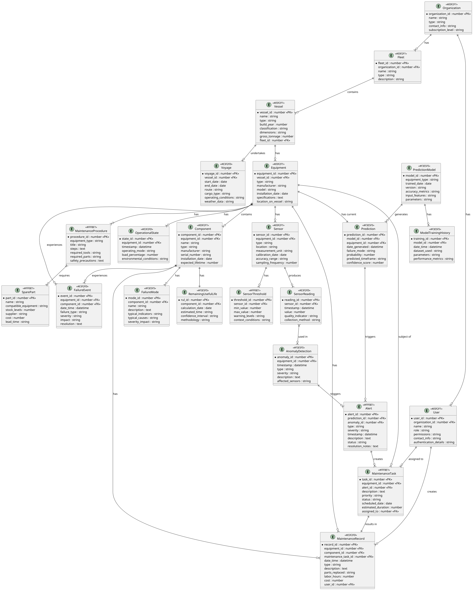

# Data and Entity Structures: Predictive Analysis System for Shipping Machinery

## 1. Core Entities

| Entity | Description | Key Attributes | Relationships |
|--------|-------------|----------------|--------------|
| **Vessel** | Represents a ship or maritime vessel | • Vessel ID • Name • Type • Build year • Classification • Dimensions • Gross tonnage | • Has many Equipment • Has many Voyages • Belongs to Fleet • Has many Maintenance Records |
| **Equipment** | Machinery or systems installed on vessels | • Equipment ID • Type • Manufacturer • Model • Installation date • Specifications • Location on vessel | • Belongs to Vessel • Has many Sensors • Has many Components • Has many Maintenance Records |
| **Component** | Individual parts within equipment | • Component ID • Name • Type • Manufacturer • Serial number • Installation date • Expected lifetime | • Belongs to Equipment • Has many Failure Modes • Has many Maintenance Records |
| **Sensor** | Devices collecting data from equipment | • Sensor ID • Type • Location • Measurement unit • Calibration date • Accuracy range • Sampling frequency | • Belongs to Equipment • Produces Sensor Readings • Has Sensor Thresholds |
| **User** | System users with different roles | • User ID • Name • Role • Permissions • Contact info • Organization • Authentication details | • Belongs to Organization • Has access to Vessels • Creates Maintenance Tasks • Receives Alerts |
| **Organization** | Companies operating vessels | • Organization ID • Name • Type • Contact info • Subscription level | • Has many Users • Owns many Vessels • Has many Fleets |
| **Fleet** | Logical grouping of vessels | • Fleet ID • Name • Type • Description | • Belongs to Organization • Contains many Vessels |

## 2. Operational Data

| Entity | Description | Key Attributes | Relationships |
|--------|-------------|----------------|--------------|
| **Sensor Reading** | Time-series data from sensors | • Reading ID • Timestamp • Value • Quality indicator • Collection method | • Belongs to Sensor • Used in Anomaly Detection |
| **Operational State** | Current operating condition | • State ID • Equipment ID • Timestamp • Operating mode • Load percentage • Environmental conditions | • Relates to Equipment • Contextualizes Sensor Readings |
| **Voyage** | Journey information for vessels | • Voyage ID • Start/end dates • Route • Cargo type • Operating conditions • Weather data | • Belongs to Vessel • Contains many Operational States |
| **Maintenance Record** | Historical maintenance activities | • Record ID • Date/time • Type (planned/unplanned) • Description • Parts replaced • Labor hours • Cost | • Relates to Equipment or Component • Created by User • May be based on Maintenance Task |
| **Failure Event** | Recorded equipment failures | • Event ID • Date/time • Equipment/component affected • Failure type • Severity • Impact • Resolution | • Relates to Equipment or Component • May relate to Failure Mode • Results in Maintenance Records |

## 3. Analytical Models

| Entity | Description | Key Attributes | Relationships |
|--------|-------------|----------------|--------------|
| **Failure Mode** | Predefined ways equipment can fail | • Mode ID • Name • Description • Typical indicators • Typical causes • Severity impact | • Relates to Equipment or Component • Used in Prediction Models • Referenced in Maintenance Procedures |
| **Prediction Model** | ML models for specific equipment | • Model ID • Equipment type • Trained date • Version • Accuracy metrics • Input features • Parameters | • Applied to Equipment type • Generates Predictions • Has Model Training History |
| **Model Training History** | Record of model training runs | • Training ID • Model ID • Date/time • Dataset used • Parameters • Performance metrics | • Belongs to Prediction Model |
| **Prediction** | Generated forecasts for equipment | • Prediction ID • Equipment ID • Date generated • Failure mode • Probability • Predicted timeframe • Confidence score | • Generated by Prediction Model • Relates to Equipment • May generate Alerts • May lead to Maintenance Tasks |
| **Anomaly Detection** | Unusual patterns in sensor data | • Anomaly ID • Equipment ID • Timestamp • Type • Severity • Description • Affected sensors | • Relates to Equipment • Based on Sensor Readings • May generate Alerts |
| **Remaining Useful Life** | Time until expected failure | • RUL ID • Component ID • Calculation date • Estimated hours/days • Confidence interval • Methodology | • Relates to Component • Used for Maintenance Planning |

## 4. Operational Management

| Entity | Description | Key Attributes | Relationships |
|--------|-------------|----------------|--------------|
| **Alert** | Notifications for users | • Alert ID • Type • Severity • Timestamp • Description • Status • Resolution notes | • Triggered by Prediction or Anomaly • Sent to Users • May create Maintenance Task |
| **Maintenance Task** | Scheduled work items | • Task ID • Equipment ID • Description • Priority • Status • Scheduled date • Estimated duration | • Relates to Equipment • Assigned to Users • May be based on Prediction • Results in Maintenance Record |
| **Maintenance Procedure** | Standard procedures for tasks | • Procedure ID • Equipment type • Title • Steps • Required tools • Required parts • Safety precautions | • Applied to Equipment type • Referenced in Maintenance Tasks |
| **Spare Part** | Inventory of replacement parts | • Part ID • Name • Compatible equipment • Stock levels • Supplier • Cost • Lead time | • Used in Maintenance Procedures • Related to Components • Used in Maintenance Records |
| **Sensor Threshold** | Boundary values for normal operation | • Threshold ID • Sensor ID • Min/max values • Warning levels • Context conditions | • Applies to Sensor • Used in Anomaly Detection |

## 5. Entity Relationships

## 6. Data Storage Considerations

| Data Type | Storage Solution | Retention Policy | Backup Strategy |
|-----------|------------------|------------------|-----------------|
| **Time-series Sensor Data** | • Time-series database (InfluxDB/TimescaleDB) • Partitioned by equipment and time periods | • Raw data: 30-90 days • Aggregated data: 1-3 years • Summary statistics: 5+ years | • Daily incremental • Weekly full backup • Geo-redundant storage |
| **Equipment Metadata** | • Relational database • Document store for specifications | • Retained for life of system plus 5 years | • Daily full backup • Point-in-time recovery |
| **Maintenance Records** | • Relational database • Document store for attachments | • Retained for life of equipment plus regulatory period (typically 7+ years) | • Daily full backup • Compliance-certified archiving |
| **Predictive Models** | • Model registry • Version control system | • All versions retained for minimum 1 year • Production versions indefinitely | • Version controlled • Reproducible builds |
| **User Activity Data** | • Relational database • Audit logs | • Detailed logs: 90 days • Summary activity: 1 year • Authentication records: 7 years | • Immutable audit trail • Compliance-certified storage |